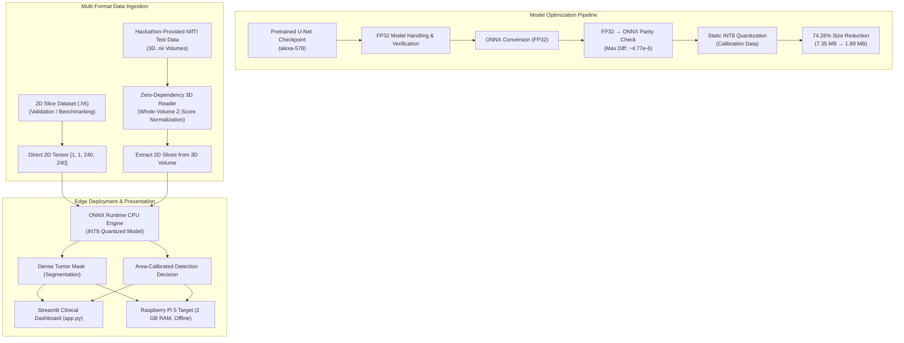
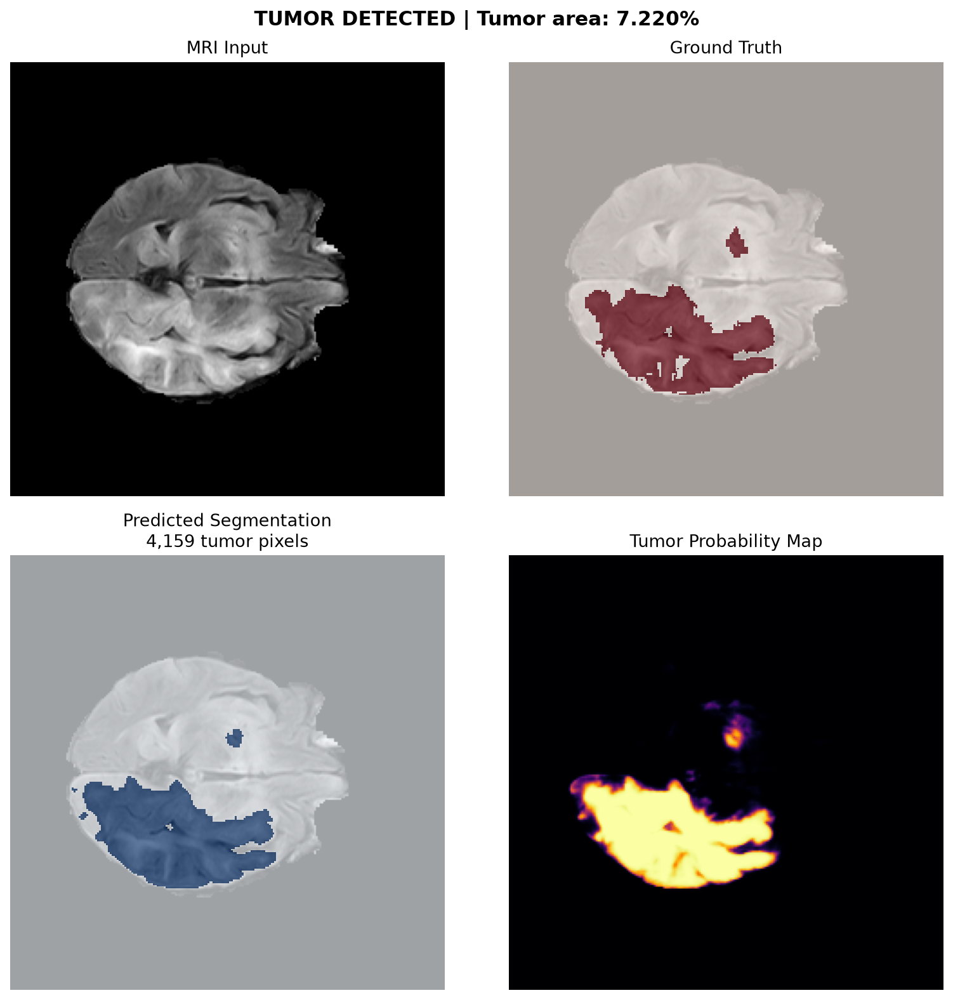
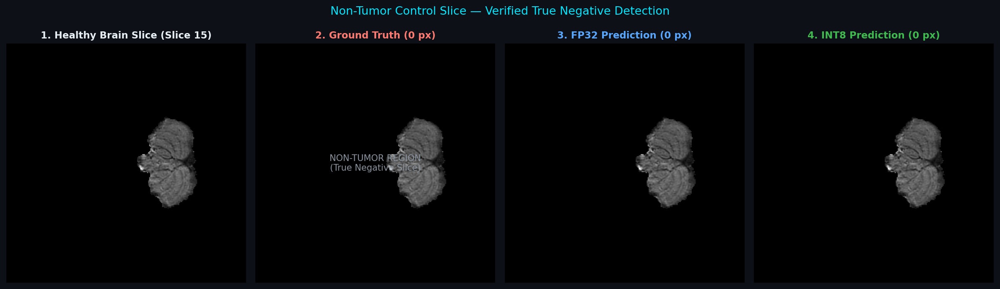

# Edge-AI-Brain-Tumor-Segmentation

> **An offline Edge AI brain-tumor segmentation system built around a pretrained U-Net, optimized from FP32 to INT8 ONNX for CPU-oriented inference and designed for Raspberry Pi 5 deployment.**

---

## 📖 Overview

Built an edge AI brain-tumor segmentation pipeline around a pretrained U-Net model, focusing on ONNX conversion, INT8 quantization, edge-oriented optimization, validation, benchmarking, reliability testing, and offline deployment.

The project demonstrates how a deep-learning biomedical segmentation model can be systematically compressed and accelerated for resource-constrained edge hardware while retaining high anatomical overlap. The resulting system features an **edge-first, offline inference architecture**, a **dual-task pipeline** (dense tumor segmentation + calibrated presence detection), a **zero-dependency 3D NIfTI reader for hackathon-provided test data**, and an **interactive Streamlit clinical dashboard**.

---

## 🔍 Problem

Standard deep-learning medical image segmentation models typically require high-power GPU servers or cloud-hosted APIs. In point-of-care clinics, rural health centers, and emergency field units, cloud dependence introduces critical bottlenecks:
* **Network Latency & Connectivity Loss**: High-resolution MRI scans cannot rely on constant, high-bandwidth internet connections.
* **Data Privacy & Compliance**: Uploading patient scans to external cloud endpoints introduces HIPAA/GDPR data-egress risks.
* **Hardware & Energy Costs**: Deploying power-hungry GPU workstations in distributed clinics is economically and logistically infeasible.

Deploying deep-learning segmentation on low-power, CPU-based edge microcomputers (such as a Raspberry Pi 5 with 2 GB RAM) provides a viable solution, but requires overcoming severe constraints in **parameter storage**, **memory bandwidth**, and **floating-point compute throughput**.

---

## 🎯 Objective

* Ingest a pretrained biomedical U-Net segmentation checkpoint.
* Export the model to ONNX FP32 and verify strict numerical parity against the original framework outputs.
* Apply static post-training INT8 quantization to reduce storage and memory bandwidth requirements.
* Quantitatively evaluate segmentation overlap (Dice similarity coefficient, IoU, Precision, Recall) on unseen validation slices from the 2D `.h5` dataset.
* Implement a standalone tumor presence detection layer based on calibrated predicted area thresholding.
* Measure inference latency, throughput, and memory consumption in a controlled benchmark environment.
* Design an offline, zero-data-egress edge deployment architecture targeting the Raspberry Pi 5 (2 GB RAM).
* Develop a zero-dependency 3D NIfTI reader to adapt hackathon-provided 3D NIfTI (`.nii`) volumes by extracting 2D axial slices for inference.
* Build an interactive clinical Streamlit dashboard for real-time visualization and inspection.

---

## 📊 Datasets & Evaluation Data

The project clearly delineates between the 2D `.h5` dataset used for model validation and the hackathon-provided 3D NIfTI test data:

### 1. 2D `.h5` Dataset (Model-Side Validation)
* **Source**: `balakrishcodes/brain-2d-mri-imgs-and-mask` (Kaggle distribution derived from BraTS 2019)
* **Format**: HDF5 (`.h5`) containing paired arrays `x` (2D FLAIR MRI slice) and `y` (ground-truth binary tumor mask)
* **Resolution**: 240 × 240 pixels (single-channel 2D slices)
* **Split**: The source dataset distribution contains an 80/20 train/validation organization; this project uses the 943-slice validation portion for FP32/INT8 evaluation.
* **Role in Project**: Used exclusively for model-side FP32 and INT8 segmentation validation, metric evaluation, and threshold calibration.
* **Associated Metrics**: The **95.57% FP32 Dice** and **95.49% INT8 Dice** validation results belong strictly to this 2D `.h5` dataset.

### 2. Hackathon-Provided NIfTI (`.nii`) Test Data (Pipeline Evaluation)
* **Source**: 3D MRI medical-imaging volumes supplied in `evaluation_data/` for hackathon evaluation:
  * `BraTS20_Training_030_flair.nii` *(Primary evaluation volume)*
  * `BraTS20_Training_030_t1.nii`
  * `BraTS20_Training_030_t1ce.nii`
  * `BraTS20_Training_030_t2.nii` *(Additional provided entry)*
* **Format**: Uncompressed 3D NIfTI-1 medical-imaging volumes (`.nii`), **NOT** `.h5` files.
* **Dimensionality**: Full 3D volumetric scans (e.g., `240 × 240 × 155` voxels).
* **Role in Project**: Supplied specifically to test and evaluate the completed inference pipeline under realistic clinical data formats.
* **Extraction Strategy**: The pretrained model requires 2D inputs `[1, 1, 240, 240]`. Therefore, **individual 2D slices are dynamically extracted from the 3D volumes** following whole-volume z-score normalization.
* **Non-Training Guarantee**: This hackathon test data was **NOT** used to train the pretrained U-Net model.

---

## ⚡ Key Results

All reported metrics reflect verified measurements obtained from the project's evaluation scripts and test logs:

* **74.26% Model-Size Reduction**: Model footprint compressed from **7.35 MB** (FP32) to **1.89 MB** (INT8).
* **95.49% INT8 Validation Dice**: The INT8 model retained **95.49% Mean Dice** across 943 unseen validation slices from the 2D `.h5` dataset (compared to **95.57%** for FP32, representing only a **0.08 percentage-point** change).
* **1.30× Measured Inference Speedup**: Mean inference latency decreased from **154.43 ms** (FP32) to **119.28 ms** (INT8) in the measured host benchmark environment.
* **8.38 FPS Measured INT8 Throughput**: An increase of +29.3% in frame throughput compared to the FP32 baseline (6.48 FPS).
* **100% Sensitivity on Evaluated Slices**: The detection layer demonstrated **100% sensitivity across 4,715 evaluated slices, with 0 false negatives** on tumor-bearing slices at a calibrated 0.001 area threshold.
* **High Conversion Parity**: Export to ONNX FP32 achieved a maximum absolute output difference of approximately **4.77e-6** against original baseline outputs.
* **Robust 3D Volume Adaptation**: Successfully extracted and processed all 155 slices from the hackathon-provided 3D NIfTI FLAIR volume, achieving 99.96% average output parity between FP32 and INT8.

---

## 🔄 System Architecture

The end-to-end engineering pipeline transitions the model from its pretrained checkpoint to an offline edge runtime supporting both 2D slices and 3D volumes:



---

## 🍓 Hardware & Edge Deployment

The project targets a self-contained, offline edge computing architecture designed for the **Raspberry Pi 5 (2 GB RAM)**:

```text
Local Brain MRI Data (2D .h5 / 2D Slices Extracted from 3D .nii Volumes)
         ↓
Direct USB / Local Storage
         ↓
Raspberry Pi 5 (2 GB RAM)
         ↓
ONNX Runtime (CPU Execution Provider)
         ↓
INT8-Quantized U-Net (1.89 MB)
         ↓
Local Tumor Segmentation Output
```

### Architectural Principles:
* **Local Inference**: All preprocessing, neural network execution, and mask generation run entirely on the local device CPU.
* **No Cloud Dependency**: Zero requirement for an internet connection, remote API calls, or cloud servers during inference.
* **Zero Data Egress**: Patient MRI data never leaves the local hardware environment, reducing exposure associated with external data transfer.
* **Edge CPU Execution**: Optimized specifically for CPU execution via ONNX Runtime's multithreaded integer compute engine.
* **Direct Local Storage Ingestion**: Direct ingestion of MRI files via USB drive or local on-device flash storage.

*Note: The hardware specifications above define the target deployment architecture. Measured benchmarks reported in this repository were collected in the host CPU test environment as documented in the benchmark section.*

---

## 🏛️ Model Provenance

To maintain full academic and technical integrity, the provenance of the underlying machine learning model is explicitly documented:

* **Pretrained Model Source**: The starting segmentation model is a pretrained U-Net architecture associated with the **alexa-578 / Alexandra Pushkin** source (`alexa-578/brats-2d-unet-brain-tumor` on Hugging Face).
* **Underlying Architecture**: 2D U-Net configured for single-channel biomedical input (`[1, 1, 240, 240]`) and binary tumor output.
* **No Claim of Scratch Training**: **This project does NOT claim to have trained the underlying U-Net from scratch.**
* **Project Scope**: Our contribution focuses on the complete engineering, compression, verification, benchmarking, and edge-deployment pipeline wrapped around the pretrained model checkpoint.

---

## 🛠️ Our Contribution

Our team's contribution consists of the extensive engineering pipeline developed around the pretrained model to prepare it for practical edge deployment:

1. **Pretrained U-Net Integration**: Ingestion, validation, and layer verification of the upstream PyTorch checkpoint.
2. **FP32 Model Verification**: Systematic baseline evaluation on 2D MRI slices.
3. **ONNX Conversion**: Exporting the dynamic PyTorch computation graph into a standardized ONNX FP32 computational graph.
4. **FP32 → ONNX Numerical Verification**: Verification of computational graph equivalence, showing a maximum absolute divergence of only ~4.77e-6.
5. **Static INT8 Quantization**: Applying post-training static INT8 quantization with representative calibration samples.
6. **Quantization Accuracy Validation**: Exhaustive metric validation across 943 unseen validation slices (Dice, IoU, Precision, Recall).
7. **Model-Size Reduction**: Achieving a 74.26% reduction in on-disk storage (7.35 MB down to 1.89 MB).
8. **Inference Benchmarking**: Structured, repeatable multi-run CPU latency and throughput profiling.
9. **Reliability Testing**: Endurance testing script measuring latency stability, runtime jitter, and memory consistency over repeated cycles.
10. **Resource Monitoring**: Process-level RAM RSS and CPU telemetry tracking.
11. **Interactive Streamlit Evaluation Dashboard**: A clinical inspection UI supporting both 2D `.h5` datasets and hackathon 3D NIfTI volumes, with 4-panel diagnostic overlays (TP / FP / FN).
12. **Hackathon NIfTI Volume Adapter**: A custom, zero-dependency pure-Python/NumPy reader for hackathon-provided 3D NIfTI (`.nii`) volumes, performing whole-volume normalization and dynamic 2D axial slice extraction.
13. **Offline Edge Deployment Architecture**: Design and implementation of a self-contained, privacy-preserving execution model.
14. **Raspberry Pi 5 Deployment Workflow**: Structuring the software dependencies and runtime parameters specifically for Raspberry Pi 5 execution.

---

## ⚙️ Model Optimization

### 1. ONNX FP32 Export & Parity Verification
The PyTorch model was exported to ONNX using fixed input dimensions `[1, 1, 240, 240]`. Numerical parity was verified on identical inputs:
* **Max Absolute Difference**: `4.7683716e-06`
* **Mean Absolute Difference**: `6.195158e-07`

### 2. Static Post-Training INT8 Quantization
Static INT8 quantization was performed using ONNX Runtime's quantization toolset with calibration data drawn from the BraTS 2D dataset distribution. Both convolutional weights and intermediate activations were mapped to 8-bit integers while preserving standard float32 graph inputs and outputs for compatibility:
* **FP32 File Size**: 7.35 MB (7,707,663 bytes)
* **INT8 File Size**: 1.89 MB (1,984,070 bytes)
* **Storage Reduction**: **74.26%**

---

## 📊 Quantitative Evaluation

### 1. Evaluation of Pretrained Model & Optimized FP32 / INT8 Variants

Evaluated on **943 unseen validation slices** from the 2D `.h5` dataset (`balakrishcodes/brain-2d-mri-imgs-and-mask`):

| Metric | ONNX FP32 | ONNX INT8 | Delta |
|:---|:---:|:---:|:---:|
| **Model Size** | 7.35 MB | **1.89 MB** | **-74.26%** |
| **Mean Dice** | 95.57% | **95.49%** | -0.08 percentage points |
| **Mean IoU** | 91.60% | **91.45%** | -0.15 percentage points |
| **Precision** | 96.01% | **95.77%** | -0.24 percentage points |
| **Recall / Sensitivity** | 95.23% | **95.33%** | +0.10 percentage points |

*Key finding: The INT8 quantized model retained 95.49% Dice on unseen validation data, exhibiting only a 0.08 percentage-point difference compared to the FP32 baseline while reducing model size by 74.26%.*

### 2. Dataset-Level Detection Evaluation

A standalone tumor detection layer (`detection/tumor_detection.py`) was evaluated across all slices of the 2D `.h5` dataset in `results/detection_evaluation.csv`:
* **Total Evaluated Slices**: 4,715 slices
* **Detection Sensitivity**: **100% sensitivity across 4,715 evaluated slices, with 0 false negatives**
* **Dataset Mean Dice**: 95.51%
* **Detection Area Threshold**: 0.001 (0.1% of slice area, ~58 pixels)

*Note: This metric reflects sensitivity of tumor presence detection derived from the segmentation mask across the evaluated slice set, not training accuracy.*

### 3. Measured Inference Benchmark

Inference latency and throughput were benchmarked using `benchmark/benchmark.py` over 100 timed runs following warmup.

*Benchmark Environment: Measured host CPU test environment (x86_64, single intra-op thread, ONNX Runtime CPUExecutionProvider)*

| Measurement | ONNX FP32 | ONNX INT8 | Improvement |
|:---|:---:|:---:|:---:|
| **Mean Latency** | 154.43 ms | **119.28 ms** | **1.30× faster (22.76% reduction)** |
| **Median Latency** | 154.00 ms | **119.35 ms** | **1.29× faster** |
| **P95 Latency** | 158.54 ms | **121.52 ms** | **1.30× faster** |
| **Min Latency** | 149.99 ms | **115.26 ms** | **1.30× faster** |
| **Max Latency** | 166.90 ms | **122.23 ms** | **1.37× faster** |
| **Throughput** | 6.48 FPS | **8.38 FPS** | **+29.3% higher throughput** |
| **Process RAM Footprint** | 164.91 MB | **153.59 MB** | **6.86% reduction** |

*Important: These measurements reflect performance within the measured host CPU test environment. They are not Raspberry Pi on-device measurements.*

---

## 🔬 Reliability & Validation

### 1. Representative Slice Segmentation
Standalone INT8 ONNX segmentation on an unseen test slice from the 2D `.h5` dataset showing close boundary alignment with ground truth:


*Slice-level Dice: 92.87% (overall INT8 validation dataset mean: 95.49%).*

### 2. Tumor Presence Detection & Probability Map
The standalone detection layer provides binary classification, tumor area percentage, and continuous probability maps:



### 3. Anti-Hallucination & Control Verification
To verify that the model does not produce false positives on non-pathological tissue, healthy control slices were evaluated. Both FP32 and INT8 models predicted exactly **0 tumor pixels** on healthy brain tissue:



---

## 🖥️ Streamlit Dashboard

The repository includes a modern Streamlit application ([app.py](file:///c:/Users/SUBHAM/Desktop/Codes/PROJECTS/Edge-AI-Brain-Tumor-Segmentation/app.py)) for interactive clinical visualization, benchmarking, and demonstration:

```bash
streamlit run app.py
```

### Dashboard Capabilities:
* **Triple Input Selection**:
  * *Browse Local 2D .h5 Dataset*: Direct navigation across patient slice directories (`BRATS_001` through `BRATS_355`).
  * *Custom 2D HDF5 Upload*: Drag-and-drop `.h5` slice upload for immediate inference.
  * *Hackathon 3D NIfTI Evaluation*: Dynamic volume loading of hackathon-provided 3D NIfTI (`.nii`) volumes and interactive 2D axial slice exploration across the volume.
* **4-Panel Diagnostic Overlay**: Highlights pixel-level classification breakdown (True Positives in green, False Positives in orange, False Negatives in blue).
* **Side-by-Side Model Comparison**: Concurrent FP32 vs. INT8 prediction overlay with individual slice Dice computation.
* **Live Hardware Telemetry**: Real-time display of execution latency (ms), frame rate (FPS), and process memory consumption.

---

## 🧠 Hackathon NIfTI (.nii) Volume Evaluation

The hackathon test data consists of **3D NIfTI (`.nii`) medical-imaging volumes** (`evaluation_data/`), rather than pre-sliced `.h5` files.

Because the underlying U-Net model was designed to ingest 2D single-channel inputs `[1, 1, 240, 240]`, the completed inference pipeline includes a zero-dependency adapter ([inference/nifti_reader.py](file:///c:/Users/SUBHAM/Desktop/Codes/PROJECTS/Edge-AI-Brain-Tumor-Segmentation/inference/nifti_reader.py)) to process these volumes without heavy dependencies:

* **Zero Heavy Dependencies**: Built using only the Python standard library and NumPy—no NiBabel, PyTorch, or TensorFlow required, making it lightweight for edge environments.
* **Binary Header Parsing**: Reads the 348-byte NIfTI-1 binary header to extract volume dimensions, datatype codes, voxel spacing, and data offsets.
* **Whole-Volume Z-Score Normalization**: Normalizes voxel intensity distributions across the full 3D volume matching the expected model distribution.
* **Dynamic 2D Axial Slice Extraction**: Extracts individual 2D axial slices from the 3D volume as `[1, 1, 240, 240]` float32 tensors for direct evaluation by the INT8 ONNX engine.
* **Tested Volumes**: Evaluated against the hackathon-provided 3D NIfTI test cases in `evaluation_data/` (`BraTS20_Training_030_flair.nii`, `t1.nii`, `t1ce.nii`, and `t2.nii`).
* **Full-Volume Parity Validation**: Verified across all 155 axial slices of `BraTS20_Training_030_flair.nii` via [inference/verify_nifti_pipeline.py](file:///c:/Users/SUBHAM/Desktop/Codes/PROJECTS/Edge-AI-Brain-Tumor-Segmentation/inference/verify_nifti_pipeline.py), achieving **99.96% average FP32 vs INT8 output parity**.

---

## 📥 Installation

### Prerequisites
* Python 3.9+ (Python 3.10 or 3.11 recommended)
* Git

### Setup
```bash
# Clone the repository
git clone https://github.com/Subham503/Edge-AI-Brain-Tumor-Segmentation.git
cd Edge-AI-Brain-Tumor-Segmentation

# Create and activate virtual environment
python -m venv .venv

# Windows
.venv\Scripts\activate

# Linux / macOS
source .venv/bin/activate

# Install required dependencies
pip install -r requirements.txt
```

---

## 💻 Usage

### 1. Launch the Streamlit Dashboard
```bash
streamlit run app.py
```

### 2. Standalone INT8 Segmentation Inference (2D Slice)
```bash
python inference/inference.py \
    --model models/unet_int8.onnx \
    --input path/to/mri_slice.h5 \
    --output results/prediction.png
```

### 3. Standalone Tumor Presence Detection
```bash
python detection/tumor_detection.py path/to/sample.h5 \
    --model models/unet_int8.onnx \
    --threshold 0.001 \
    --output results/detection_result.png
```

### 4. Run CPU Latency & Throughput Benchmark
```bash
python benchmark/benchmark.py \
    --fp32 models/unet_fp32.onnx \
    --int8 models/unet_int8.onnx \
    --input path/to/sample.h5 \
    --runs 100
```

### 5. Verify Hackathon 3D NIfTI Pipeline (Extract Slices from Volume)
```bash
python inference/verify_nifti_pipeline.py
```

### 6. Run Reliability & Endurance Test
```bash
python reliability/reliability_test.py \
    --h5 path/to/sample.h5 \
    --model models/unet_int8.onnx \
    --runs 100
```

### 7. Run Full-Dataset Detection Evaluation (2D .h5 Dataset)
```bash
python evaluation/detection_accuracy.py \
    --data-dir path/to/extracted \
    --model models/unet_int8.onnx \
    --output-csv results/detection_evaluation.csv
```

---

## 🗂️ Repository Structure

```text
Edge-AI-Brain-Tumor-Segmentation/
│
├── app.py                            # Streamlit interactive clinical dashboard
├── requirements.txt                  # Minimal runtime dependencies
├── README.md                         # Project documentation
│
├── models/                           # Optimized ONNX model artifacts
│   ├── unet_fp32.onnx                # Baseline FP32 ONNX model (7.35 MB)
│   └── unet_int8.onnx                # Quantized INT8 ONNX model (1.89 MB)
│
├── detection/                        # Standalone tumor detection layer
│   └── tumor_detection.py            # Detection CLI with calibrated area threshold
│
├── evaluation/                       # Dataset-wide evaluation scripts
│   └── detection_accuracy.py         # 4,715-slice evaluation pipeline
│
├── evaluation_data/                  # Hackathon-provided 3D NIfTI (.nii) test data
│   ├── BraTS20_Training_030_flair.nii# 3D MRI volume (FLAIR modality)
│   ├── BraTS20_Training_030_t1.nii   # 3D MRI volume (T1 modality)
│   ├── BraTS20_Training_030_t1ce.nii # 3D MRI volume (T1ce modality)
│   └── BraTS20_Training_030_t2.nii   # 3D MRI volume (T2 modality)
│
├── inference/                        # Core inference & data ingestion adapters
│   ├── inference.py                  # Standalone 2D slice inference script
│   ├── nifti_reader.py               # Zero-dependency pure-NumPy 3D NIfTI reader
│   ├── verify_nifti_pipeline.py      # Standalone NIfTI pipeline verification
│   ├── test_full_pipeline.py         # End-to-end H5 & NIfTI regression test
│   ├── validate_dataset.py           # Slice-level validation script
│   └── run_rigorous_cross_verification.py # Control & anti-hallucination test suite
│
├── benchmark/                        # Benchmarking module
│   └── benchmark.py                  # Latency, FPS, P95, RAM, and CPU benchmark
│
├── monitoring/                       # Hardware telemetry module
│   └── resource_monitor.py           # Process RAM (RSS) & CPU usage monitor
│
├── reliability/                      # Hardware endurance module
│   └── reliability_test.py           # Stability, latency jitter & leak test
│
├── results/                          # Benchmark and evaluation outputs
│   ├── benchmark_results.csv         # Measured CPU benchmark logs
│   ├── detection_evaluation.csv      # 4,715-slice detection evaluation data
│   ├── verified_prediction.png       # Representative segmentation output
│   └── detection_result.png          # 4-panel detection visualization
│
├── verification_results/             # Control slice verification artifacts
│   ├── non_tumor_control_slice15.png # True negative verification on healthy brain
│   ├── tumor_heavy_BRATS_249_86.png  # Heavy tumor slice verification
│   ├── tumor_medium_BRATS_249_71.png # Medium tumor slice verification
│   └── tumor_boundary_BRATS_249_59.png# Small boundary tumor verification
│
├── notebooks/                        # Experimental verification notebooks
│   ├── Edge_AI_Model_Verification.ipynb
│   └── INT8_ONNX_Verification.ipynb
│
└── Presentations/                    # Project presentation slide decks
    ├── EDGE-AI_Brain_Tumor_Segmentation.pptx
    └── EDGE-AI_PPT.pptx
```

---

## ⚠️ Limitations & Scope

1. **Pretrained Model Foundation**: The underlying segmentation model is a pretrained U-Net checkpoint. The project scope centers on post-training model compression, ONNX conversion, INT8 quantization, edge benchmarking, and deployment architecture, rather than training a novel segmentation architecture from scratch.
2. **Measurement Environment**: Benchmark results reported in the quantitative tables reflect the measured host CPU test environment. Raspberry Pi specifications documented in the project define the target edge deployment architecture.
3. **2D Slice-Based Inference on 3D Volumes**: The underlying segmentation model operates on 2D axial slices (`[1, 1, 240, 240]`). For hackathon-provided 3D NIfTI volumes, individual 2D axial slices are extracted and processed sequentially by the inference engine, rather than utilizing 3D volumetric convolutions across the z-axis.
4. **Research Prototype**: This system is an academic and engineering prototype designed for research and decision-support exploration. It is **not** an FDA/CE-cleared medical diagnostic system and must not be used as the sole basis for clinical diagnosis or treatment planning.

---

## 🚧 Project Status

### Completed Engineering & Validation
- [x] Ingest and verify pretrained U-Net PyTorch checkpoint
- [x] Export to ONNX FP32 with numerical parity verification (diff ~4.77e-6)
- [x] Static INT8 post-training quantization (74.26% size reduction: 7.35 MB → 1.89 MB)
- [x] Quantization validation on 943 unseen slices from the 2D `.h5` dataset (retained 95.49% Dice, -0.08 delta)
- [x] Measured CPU inference benchmarking (119.28 ms mean latency, 8.38 FPS)
- [x] Standalone tumor presence detection layer with calibrated area threshold
- [x] Dataset-level detection evaluation on the 2D `.h5` dataset (100% sensitivity across 4,715 evaluated slices)
- [x] Zero-dependency pure-NumPy 3D NIfTI reader for hackathon-provided test volumes (`nifti_reader.py`)
- [x] Full-volume axial slice extraction and verification on hackathon NIfTI test data (99.96% parity)
- [x] Interactive clinical & edge Streamlit dashboard (`app.py`)
- [x] Hardware telemetry and resource monitoring module (`resource_monitor.py`)
- [x] Inference endurance, latency-jitter, and memory-consistency testing in the measured host environment (`reliability_test.py`)
- [x] Anti-hallucination non-tumor control validation (0 false positives on healthy tissue)

### Physical Hardware Roadmap
- [ ] Measure on-device inference latency directly on physical Raspberry Pi 5 hardware
- [ ] Measure on-device power consumption and thermal throttling under sustained load
- [ ] Profile cold-start model load time into Raspberry Pi ARM system cache

---

## 📚 Model Attribution & References

* **Pretrained U-Net Model Checkpoint**: Alexandra Pushkin (`alexa-578`), [Hugging Face Repository: `alexa-578/brats-2d-unet-brain-tumor`](https://huggingface.co/alexa-578/brats-2d-unet-brain-tumor)
* **Reference Repository**: Alexandra Pushkin, [GitHub: `AlexandraPushkin/brain-tumor-segmentation-unet`](https://github.com/AlexandraPushkin/brain-tumor-segmentation-unet)
* **Model Validation Dataset (2D .h5)**: Kaggle 2D HDF5 distribution (`balakrishcodes/brain-2d-mri-imgs-and-mask`), derived from BraTS 2019, used for model-side FP32/INT8 validation metrics.
* **Hackathon Test Data (3D .nii)**: Multi-parametric 3D NIfTI (`.nii`) volumes supplied for hackathon pipeline evaluation (`evaluation_data/`).
* **Runtime**: [ONNX Runtime](https://onnxruntime.ai/)
