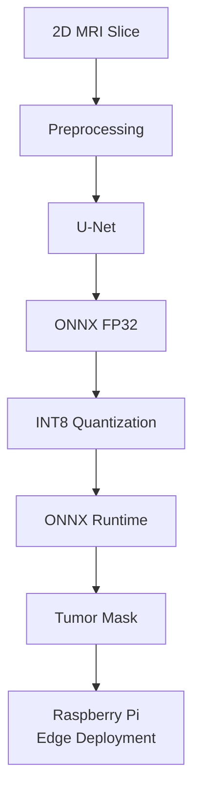
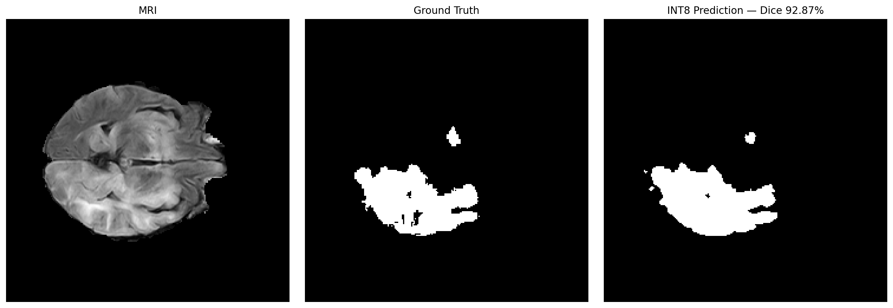

# Edge-AI-Brain-Tumor-Segmentation

> Edge AI brain tumor segmentation using U-Net, ONNX Runtime, and INT8 quantization, targeting Raspberry Pi deployment.

An end-to-end medical image segmentation project that explores how a U-Net brain tumor segmentation model can be optimized for resource-constrained edge hardware.

The project covers model training, unseen-data validation, ONNX conversion, INT8 quantization, CPU benchmarking, and preparation for Raspberry Pi deployment.

---

## 🔄 System Pipeline



---

## 🎯 Objectives

- Train a U-Net model for brain tumor segmentation.
- Evaluate the model on unseen MRI slices.
- Export the trained PyTorch model to ONNX.
- Verify ONNX FP32 against the original PyTorch model.
- Apply static INT8 quantization.
- Compare FP32 and INT8 segmentation performance.
- Reduce model size and inference latency.
- Deploy and benchmark the optimized model on Raspberry Pi.

---

## 📊 Dataset

The model was trained using a BraTS-derived 2D brain MRI dataset.

| Property | Value |
|---|---|
| Total slices | 4,715 |
| Image resolution | 240 × 240 |
| Training slices | 3,772 |
| Validation slices | 943 |
| Split | 80/20 |
| Input channels | 1 |
| Output channels | 1 |

The segmentation masks contain multiple non-zero tumor labels: `[0, 50, 100, 150]`

For this binary segmentation experiment, all non-zero pixels are treated as tumor.

The dataset is not included in this repository.

---

## 🧠 Model

### U-Net

The segmentation model uses a U-Net architecture designed for biomedical image segmentation.

### Training configuration

| Parameter | Value |
|---|---|
| Framework | PyTorch |
| Architecture | U-Net |
| Input | 1 × 240 × 240 |
| Output | 1 × 240 × 240 |
| Loss | BCEWithLogitsLoss |
| Optimizer | Adam |
| Learning rate | 1e-3 |
| Training samples | 3,772 |
| Validation samples | 943 |

---

## 🔄 ONNX Conversion

After training, the PyTorch model was exported to ONNX.

Two versions were evaluated:

- ONNX FP32
- ONNX INT8

The PyTorch and ONNX FP32 outputs were compared using the same input.

### PyTorch vs ONNX verification

```text
Maximum absolute difference: 4.7683716e-06
Mean absolute difference:    6.195158e-07
```

Both models produced:

```text
Input:  [1, 1, 240, 240]
Output: [1, 1, 240, 240]
```

---

## ⚡ INT8 Quantization

Static INT8 quantization was applied to the ONNX model using calibration data.

### Model size

| Model | Size |
|---|---|
| FP32 | 7.35 MB |
| INT8 | 1.89 MB |

**Model size reduction: 74.26%**

---

## 📈 Validation Results

The models were evaluated on 943 unseen validation MRI slices.

### FP32 vs INT8

| Metric | ONNX FP32 | ONNX INT8 |
|---|---|---|
| Mean Dice | 95.57% | 95.49% |
| Mean IoU | 91.60% | 91.45% |
| Precision | 96.01% | 95.77% |
| Recall | 95.23% | 95.33% |

### Quantization impact

```text
Dice change:          -0.08 percentage points
Model size reduction: 74.26%
```

The INT8 model retained very similar validation segmentation metrics while substantially reducing model size.

---

## ⚡ CPU Benchmark

A fair CPU benchmark was performed for ONNX FP32 and INT8 inference.

| Measurement | FP32 | INT8 |
|---|---|---|
| Mean latency | 347.81 ms | 305.50 ms |
| Median latency | 303.41 ms | 251.13 ms |

```text
Speedup:           1.14×
Latency reduction: 12.16%
```

These measurements were obtained in the current CPU environment. They are **not** Raspberry Pi measurements.

---

## 🖼️ Visual Validation

A representative unseen validation MRI slice was passed through the standalone INT8 inference pipeline.



### Representative slice results

| Measurement | Value |
|---|---:|
| Predicted tumor pixels | 4,159 |
| Ground-truth tumor pixels | 3,930 |
| Dice score | **92.87%** |

The 92.87% Dice score is for this individual MRI slice.

The overall INT8 validation result is **95.49% mean Dice across 943 validation slices.**

---

## ⚙️ Standalone Inference

The repository contains a standalone inference pipeline:

```text
inference/
└── inference.py
```

The script performs:

- MRI loading
- Preprocessing
- INT8 ONNX inference
- Sigmoid conversion
- Binary tumor-mask generation
- Dice calculation when ground truth is available
- Result visualization

### Example

```bash
python inference/inference.py \
    --model models/unet_int8.onnx \
    --input path/to/mri_slice.h5 \
    --output prediction.png
```

---

## 🍓 Raspberry Pi Deployment

Raspberry Pi deployment is a core part of this project and is still pending hardware validation.

The current software pipeline has been prepared around the INT8 ONNX model specifically to support resource-constrained edge deployment.

### Planned hardware evaluation

Once the Raspberry Pi is available, the following will be measured:

- INT8 inference latency
- End-to-end inference time
- RAM usage
- CPU utilization
- Model loading time
- Prediction correctness
- Practical edge deployment behavior

The actual Raspberry Pi measurements will be added to this repository after testing.

---

## 🗂️ Project Structure

```text
Edge-AI-Brain-Tumor-Segmentation/
│
├── models/
│   ├── unet_fp32.onnx
│   ├── unet_int8.onnx
│   └── brats_unet_modell.pth
│
├── inference/
│   └── inference.py
│
├── results/
│   └── verified_prediction.png
│
├── notebooks/
├── data/
├── scripts/
│
├── README.md
├── requirements.txt
└── .gitignore
```

---

## 🛠️ Technologies

- Python
- PyTorch
- U-Net
- ONNX
- ONNX Runtime
- NumPy
- h5py
- Matplotlib
- scikit-learn
- INT8 Quantization
- Raspberry Pi

---

## 🚧 Project Status

### Software / Model Pipeline

- [x] Dataset preparation
- [x] U-Net training
- [x] Unseen validation
- [x] PyTorch FP32 evaluation
- [x] ONNX FP32 export
- [x] PyTorch vs ONNX verification
- [x] ONNX FP32 validation
- [x] INT8 quantization
- [x] INT8 validation
- [x] FP32 vs INT8 comparison
- [x] CPU benchmarking
- [x] Standalone inference pipeline
- [x] Real unseen MRI verification
- [x] Visual validation

### Hardware

- [ ] Raspberry Pi deployment
- [ ] Raspberry Pi INT8 inference
- [ ] Raspberry Pi latency benchmark
- [ ] Raspberry Pi memory benchmark
- [ ] End-to-end hardware/software evaluation

---

## 🔬 Future Work

- Deploy the INT8 model on Raspberry Pi.
- Measure real edge-device latency and memory usage.
- Optimize ONNX Runtime configuration for Raspberry Pi.
- Evaluate additional MRI slices and datasets.
- Explore further model optimization if required.
- Build a lightweight MRI upload and segmentation interface.
- Investigate multi-class tumor segmentation.

---

## ⚠️ Disclaimer

This project is an academic and engineering prototype for brain MRI segmentation.

It is not a medical diagnostic system and should not be used to make clinical decisions.

The reported metrics represent performance on the dataset and validation procedure described in this repository and should not be interpreted as clinical performance.

---

## Project

**Edge-AI-Brain-Tumor-Segmentation**

An Edge AI project combining deep-learning-based medical image segmentation with model optimization and planned Raspberry Pi deployment.
